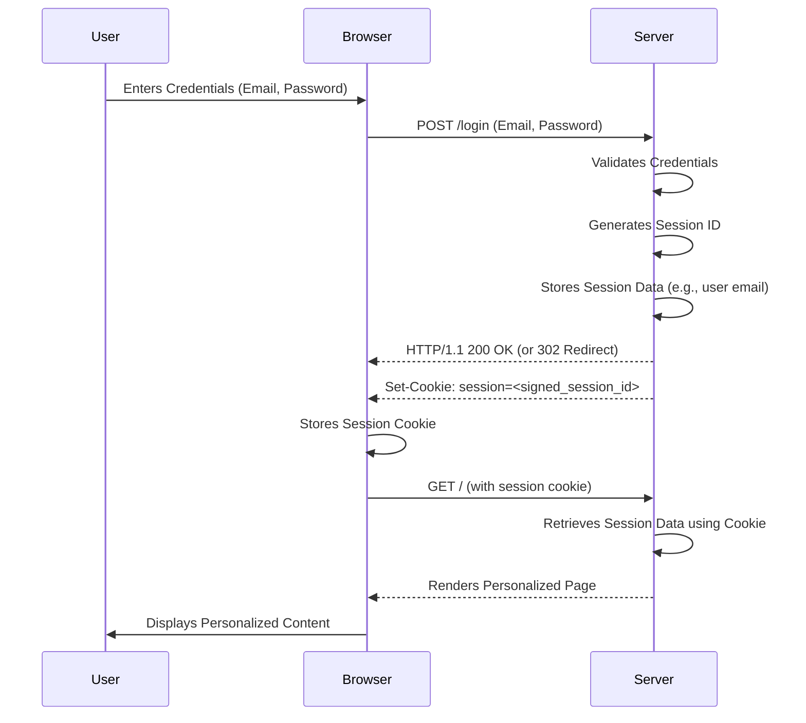
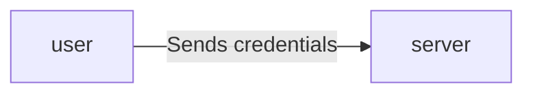

# Obsidian Notes, use full note to get the references and updates , or use the website.
# # Session Cookie Authentication 
 > - Used to authenticate users across multiple requests
 > - For maintaining state in web applications




1. User sends login request with credentials
>```bash
>curl -X POST http://localhost:5000/login -d "username=user&password=pass"
>```


```html
<form action="/login" method="POST">
  <h2>Login</h2>
  <input type="email" name="email" placeholder="Email" required />
  <input type="password" name="password" value="Password" required />
  <button type="submit">Login</button>
  <p>
	If you dont have an account
	<a href="#" onClick="toggleForm('register-form')"> Register Here</a>
  </p>
</form>

```

2. Server validates credentials
```python
@app.route("/login", methods=["POST"])
def login():
    email = request.form.get("email")
    password = request.form.get("password")
    user = users.get(email)
    if not user or not check_password_hash(user["password"], password):
        flash("Invalid credentials. Please try again.", "danger")
        return redirect(url_for("index"))

    flash(f'Welcome, {user["name"]}!', "success")
    session["email"] = user["email"]
    return redirect(url_for("index"))
```
- retrieves `email` and `password` from the `request` 
> ```python
>email = request.form.get("email")
>password = request.form.get("password")
>```
- checks if the user exists in the `users{}` 
```python
user = users.get(email)
if not user or not check_password_hash(user["password"], password):
	flash("Invalid credentials. Please try again.", "danger")
	return redirect(url_for("index"))
```
- if exists **redirect** to the home page(`index.html`) 
```python
return redirect(url_for("index"))
```

-  Server sets session cookie
```python
session["email"] = user["email"]
```

>[!abstract]- *Getting the session cookie*
>```bash
>sudo tshark -i lo -Y "http.response and http.set_cookie" -T fields -e http.set_cookie
>```
>```
>session=eyJfZmxhc2hlcyI6W3siIHQiOlsiaW5mbyIsIllvdSBoYXZlIGJlZW4gbG9nZ2VkIG91dC4iXX1dfQ.aGW03A.dsa7-eUSUlXQsU9S70nJz9vOvdE; HttpOnly; Path=/
>session=; Expires=Thu, 01 Jan 1970 00:00:00 GMT; Max-Age=0; HttpOnly; Path=/
>```
>
>![[Pasted image 20250703041327.png]]


## Resources 
1. https://youtu.be/LiomRvK7AM8?si=3kIUDgn-Lqhj3qRi
2. https://aruncs31s-notes-vercel.vercel.app/03-coding/web/authenticaion/session-cookie-authenticaion/
3. https://github.com/aruncs31s/Notes/blob/archLinux/03%20Coding/Web/Authenticaion/Session%20Cookie%20Authenticaion.md
